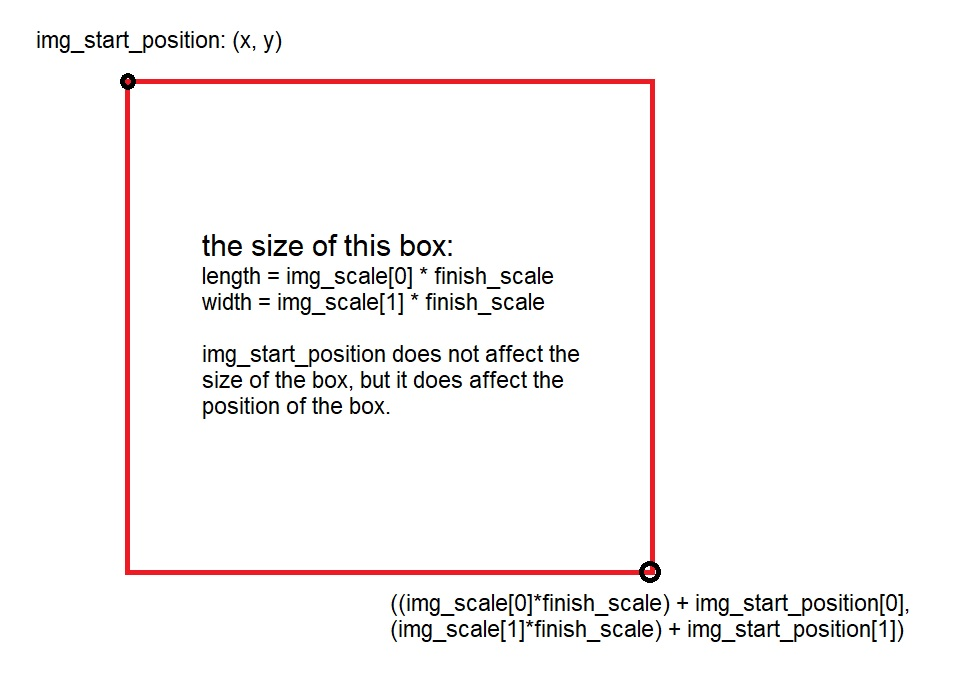

# The mouse project

## Running this

1. Install Python 3.10 or later. This program was made to work with Python 3.10
2. `pip install` the following packages:
   1. `pynput`
   2. `mouse`
   3. `PIL`
3. Download the stuff in this repo by cloning it. If your downloading it by `zip`, export everything to an empty folder.
4. Using Python or any IDE, run `main.py`. The most traditional way is by opening command prompt in the same folder as `main.py` (use CD), and then running the command `py main.py`.

No `bat` file for your own safety

Please read the rest of this document before running this program. A sample image is included, though.

**THIS PROGRAM TAKES CONTROL OF YOUR MOUSE. TO STOP THIS PROGRAM, PRESS ANY KEY ON YOUR KEYBOARD. I AM NOT RESPONSIBLE IF YOU HAVE SENSITIVE WINDOWS OPEN.**

## Variables

Set your variables in `variables.json`.

- `path_to_img`: the path to the image relative to `main.py`. **THE FILE SHOULD BE PNG/JPG/JPEG**
- `tolerance`: how tolerant the program is to detecting "black" parts in the image from a scale of 0-255.
- `p_tolerance`: increasing this makes the program faster but makes the output image more ugly.
- `path_to_img`: relative to this `.ipynb` notebook.
- `img_start_location`: the coords on your screen (FIRST MONITOR IF YOU'RE USING MULTIPLE MONITORS) where the drawing starts
- `img_scale`: this can stretch the image. How large the image drawn by this program is.
- `finish_scale`: directly multiplies `img_scale`... kind of. It is faster to set `finish_scale` to 2 and `img_scale` to `(250, 250)` then set `finish_scale` to 1 and `img_scale` to `(500, 500)` - actually, it doesn't really speed it up by 4x.

There is a sample image (`nya.png`) that is made by me if you want to test this program.

## Declare your variables above.
You should do it before running the program. Keep in mind that when we talk about coordinates, for coordinates `(x, y)`, `x` is always positive to the right and `y` is always positive **downwards** - this may be different than what you have learned in math class.

## Run the cell below to run the program.

The coordinates are ALWAYS the position of the pixels on your Windows 10 UI. Changing the window size does not affect anything in this program.

## I have two monitors. Which monitor will this program draw on? (Windows)

Always your "first" monitor. You can check which monitor is your first monitor by the one where you can see `Type here to Search` on it, for Windows. If you can see this on your monitor, this is the one this program will draw on.

